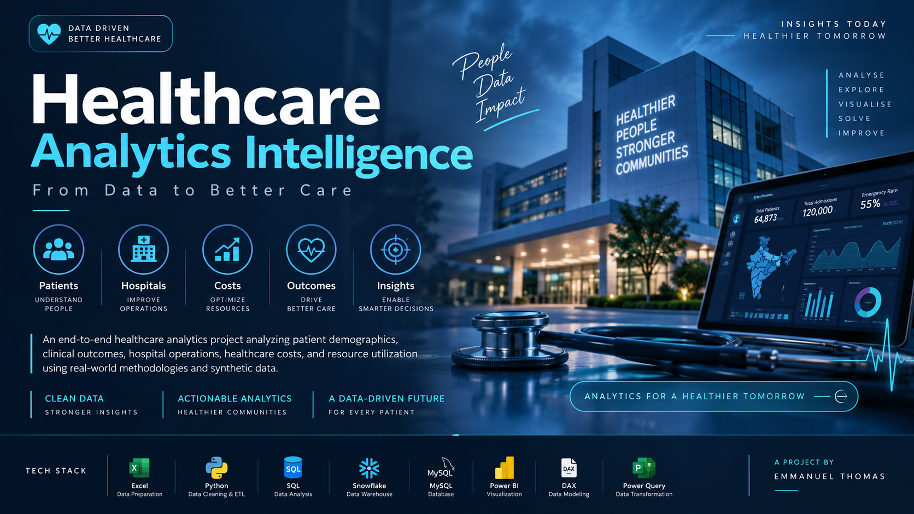
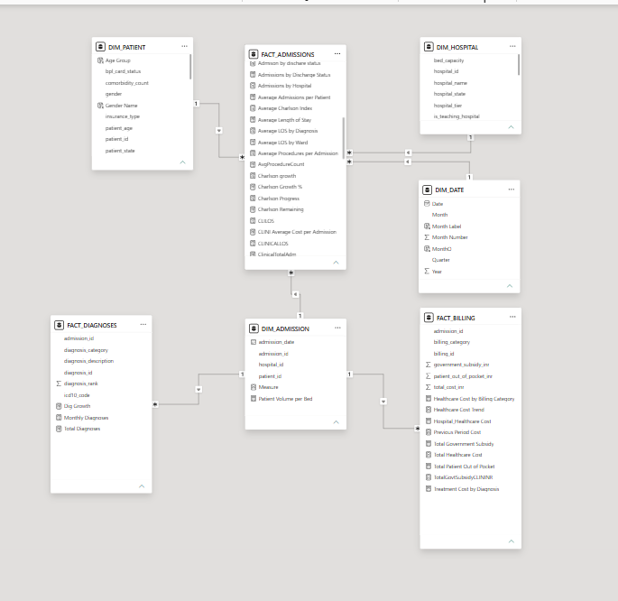

# 🏥 Healthcare Analytics Intelligence

<p align="center">
  
</p>

<p align="center">
  <strong>END-TO-END HEALTHCARE DATA ANALYTICS & BUSINESS INTELLIGENCE</strong>
</p>

<p align="center">
  Transforming <strong>597K+ healthcare records</strong> into actionable patient, clinical, operational, financial and hospital intelligence.
</p>

<p align="center">
  <a href="#executive-overview">Overview</a> •
  <a href="#solution-architecture">Architecture</a> •
  <a href="#dashboard-suite">Dashboards</a> •
  <a href="#key-business-insights">Insights</a> •
  <a href="#technology-stack">Technology</a> •
  <a href="#repository-structure">Repository</a>
</p>

<p align="center">
  
  
  
  
  
  
  
  
</p>

---

## 🎯 Executive Overview

**Healthcare Analytics Intelligence** is an end-to-end healthcare analytics and business intelligence solution designed to transform fragmented healthcare data into a unified analytical environment.

### Domain Volume

| Metric | Value |
|---|---|
| 👤 Patients | **86,400** |
| 🏥 Admissions | **120,000** |
| 💳 Billing Records | **120,000** |
| 🩺 Diagnoses | **271,341** |
| 🏨 Hospitals | **33** |
| 📊 Total Records | **597,774** |

**Raw Data → Data Preparation → Data Quality → SQL → Data Warehousing → Data Modeling → DAX → Visualization → Business Insights**

---

## 💡 Business Challenge

Healthcare organizations generate large volumes of information across patients, admissions, diagnoses, billing and hospital operations.

The challenge is transforming these disconnected datasets into **reliable, interpretable and decision-ready intelligence**.

This project answers questions around patient demand, readmission risk, clinical workload, ward utilization, healthcare expenditure, hospital capacity and patient complexity.

---

## 🏗️ Solution Architecture

```text
                         HEALTHCARE DATA
                               │
                               ▼
                  ┌─────────────────────────┐
                  │      RAW DATASETS       │
                  │ Patients • Admissions   │
                  │ Billing • Diagnoses     │
                  │ Hospitals               │
                  └────────────┬────────────┘
                               ▼
                  ┌─────────────────────────┐
                  │    DATA PREPARATION     │
                  │    Excel • Python       │
                  │         Pandas          │
                  └────────────┬────────────┘
                               ▼
                  ┌─────────────────────────┐
                  │ DATA QUALITY & CLEANING │
                  │ Nulls • Duplicates      │
                  │ Validation • Standards  │
                  └────────────┬────────────┘
                               ▼
                       CLEAN DATASETS
                               │
                     ┌─────────┴─────────┐
                     ▼                   ▼
              ┌──────────────┐    ┌──────────────┐
              │    MySQL     │    │  Snowflake   │
              │ Relational DB│    │ Cloud DWH    │
              └──────┬───────┘    └──────┬───────┘
                     └─────────┬─────────┘
                               ▼
                      ┌─────────────────┐
                      │   SQL ANALYTICS │
                      └────────┬────────┘
                               ▼
                      ┌─────────────────┐
                      │  POWER BI MODEL │
                      │ Dimensions/Facts│
                      └────────┬────────┘
                               ▼
                      ┌─────────────────┐
                      │  DAX KPI ENGINE │
                      └────────┬────────┘
                               ▼
                      ┌─────────────────┐
                      │  BI DASHBOARDS  │
                      └────────┬────────┘
                               ▼
                       BUSINESS INSIGHTS
                               ▼
                       DECISION SUPPORT
```

---

## 📊 Data Portfolio

| Dataset | Records | Purpose |
|---|---|---|
| Patients | 86,400 | Demographics, insurance & population |
| Admissions | 120,000 | Admissions, LOS, wards & readmission |
| Billing | 120,000 | Healthcare expenditure & funding |
| Diagnoses | 271,341 | Clinical diagnosis intelligence |
| Hospitals | 33 | Hospital capacity & performance |
| **Total** | **597,774** | **Integrated healthcare intelligence** |

---

## 🧹 Data Preparation & Quality

The project combines **Excel, Python and Pandas** to convert raw healthcare data into analysis-ready datasets.

### Profiling
- Dataset structure analysis
- Data-type inspection
- Missing-value analysis
- Duplicate detection
- Identifier validation

### Cleaning
- Missing-value handling
- Date standardization
- Column-name standardization
- Data-type conversion
- Business-rule validation

### Validation
- Referential integrity
- Unique identifier checks
- Billing consistency
- Length-of-stay validation
- Diagnosis-rank validation
- Admission and hospital relationship validation

---

## 🗄️ Data Engineering Layer

### MySQL
Used for database creation, table creation, data loading, SQL analysis, validation and relational integrity checks.

### Snowflake
Used for cloud data warehouse design, staging, file formats, data loading, analytical tables and validation.

Together, these layers demonstrate experience with **relational databases and cloud data warehousing**.

---

## 🧩 Power BI Data Model

### Dimension Layer
`DIM_PATIENT` • `DIM_HOSPITAL` • `DIM_DATE` • `DIM_ADMISSION`

### Fact Layer
`FACT_ADMISSIONS` • `FACT_BILLING` • `FACT_DIAGNOSES`

<p align="center">
  
</p>

The model supports patient, hospital, date, clinical, operational and financial analysis through controlled filter propagation.

---

## ⚙️ DAX KPI Engineering

| KPI | Business Purpose |
|---|---|
| Total Patients | Unique patient population |
| Total Admissions | Admission volume |
| Total Healthcare Cost | Overall healthcare expenditure |
| 30-Day Readmission Rate | Patient readmission risk |
| Average Length of Stay | Hospitalization duration |
| Government Subsidy | Government funding |
| Patient Out-of-Pocket Cost | Direct patient expenditure |
| ICU Admission Share | Critical-care demand |
| Average Procedures per Admission | Treatment intensity |
| Average Charlson Index | Clinical complexity |
| Total Bed Capacity | Hospital resource capacity |
| Patient Volume per Bed | Capacity utilization |

---

## 📈 Dashboard Suite

### 01 — Healthcare Executive Overview

<p align="center">
  
</p>

Executive view of patient demand, admissions, healthcare cost, readmission, ward performance, patient profile and operational health.

### 02 — Patient Population Intelligence

<p align="center">
  
</p>

Population intelligence covering patient retention, age segmentation, state distribution, insurance, BPL support and patient complexity.

### 03 — Operations & Financial Intelligence

<p align="center">
  
</p>

Operational and financial intelligence covering expenditure, subsidies, patient payments, bed capacity, LOS and ward utilization.

### 04 — Clinical Patient Journey

<p align="center">
  
</p>

Clinical intelligence covering discharge outcomes, diagnosis patterns, long stays, diagnosis categories, treatment costs and readmission.

### 05 — Hospital Performance & Clinical Intelligence

<p align="center">
  
</p>

Integrated hospital intelligence covering readmission vs complexity, procedure utilization, ward cost, bed capacity, diagnosis-level LOS and monthly outcomes.

---

## 🔎 Key Business Insights

### Emergency Care Drives Demand
Emergency admissions represent approximately **55% of total admissions**.

### General Ward Has the Highest Utilization
General Ward represents approximately **64% of admissions**.

### Older Patients Have Higher Clinical Risk
Patients aged **66+** show a **20.4%** 30-day readmission rate, **7.83 days** average LOS and **3.68** average Charlson Index.

### Readmission Risk Increases With Age

| Age Group | Patients | Avg LOS | Readmission | Avg Charlson |
|---|---|---|---|---|
| 0–17 | 11,685 | 6.97 | 6.2% | 0.41 |
| 18–35 | 9,669 | 5.80 | 5.3% | 0.47 |
| 36–65 | 46,860 | 6.66 | 11.3% | 1.87 |
| 66+ | 18,186 | 7.83 | 20.4% | 3.68 |

---

## 💰 Financial Intelligence

The healthcare system generates more than **₹11.4 billion** in healthcare expenditure.

| Financial Metric | Value |
|---|---|
| Government Subsidy | **₹5.71B** |
| Patient Out-of-Pocket | **₹5.78B** |
| Total Healthcare Cost | **₹11.4B+** |

Major billing categories include Pharmacy, Procedures, Room and Laboratory.

---

## 🏥 Hospital & Resource Intelligence

The healthcare network includes:

**33 Hospitals • 14,535 Beds • 15 States**

Hospital analysis evaluates patient volume, bed capacity, patient volume per bed, LOS, readmission, clinical complexity, procedure utilization and hospital tier.

---

## 🎯 Decision Support

| Area | Decision Support |
|---|---|
| Capacity | Improve demand and capacity planning |
| Clinical | Identify complex and high-risk patients |
| Readmission | Monitor high-risk segments |
| Financial | Track expenditure and funding |
| Operations | Optimize ward and hospital utilization |
| Resources | Compare demand with capacity |
| Performance | Benchmark hospitals using KPIs |

---

## 🎨 UI/UX Design

The dashboards follow an executive-focused visual system built around:

- Strong visual hierarchy
- Consistent KPI cards
- Dark executive interface
- Structured information density
- Clear section separation
- Interactive slicers
- Cross-filtering
- Drill-through navigation
- Business-focused storytelling

The objective is to create a **decision-oriented analytical experience**, not simply a collection of charts.

---

## 🛠️ Technology Stack

### Data Preparation
`Excel` • `Python` • `Pandas`

### Database & Warehousing
`SQL` • `MySQL` • `Snowflake`

### Business Intelligence
`Power BI` • `DAX`

### Analytics
`ETL` • `Data Cleaning` • `Data Profiling` • `Data Validation` • `Data Modeling`

### Visualization
`Data Visualization` • `Dashboard Design` • `UI/UX` • `Data Storytelling`

### Advanced BI
`Interactive Slicers` • `Cross-Filtering` • `Drill-Through Analysis` • `Dynamic Measures` • `Time Intelligence` • `KPI Engineering`

---

## 📂 Repository Structure

```text
Healthcare-Analytics-Intelligence/
│
├── 00_Project_Overview/
│   ├── Cover.png
│   ├── Project_Overview.md
│   ├── Executive_Summary.md
│   └── Project_Architecture.md
│
├── 02_Excel Data/
│   ├── Raw/
│   └── Cleaned/
│
├── 03_Python/
│   ├── 01_patients_profiling_cleaning.py
│   ├── 02_admissions_profiling_cleaning.py
│   ├── 03_billing_profiling_cleaning.py
│   ├── 04_diagnoses_profiling_cleaning.py
│   ├── 05_hospitals_profiling_cleaning.py
│   ├── requirements.txt
│   └── README.md
│
├── 04_SQL/
│   ├── Healthcare_SQL_Analysis.sql
│   ├── MySQL_Setup.sql
│   └── MySQL_Validation.sql
│
├── 05_Snowflake/
│   └── Healthcare_Snowflake_Setup.sql
│
├── 06_PowerBI/
│   ├── PowerBI_Dashboard.md
│   ├── Data_Model.png
│   └── DAX/
│       └── Healthcare_Dashboard_DAX_Measures.dax
│
├── 07_Dashboards/
│   ├── 01_Healthcare_Executive_Overview.jpg
│   ├── 02_Patient Population Intelligence.jpg
│   ├── 03_Operations & Financial Intelligence.jpg
│   ├── 04_Clinical Patient Journey.jpg
│   └── 05_Hospital Performance & Clinical Intelligence.jpg
│
├── 08_Insights/
│   ├── Executive_Insights.md
│   └── Healthcare_Analytics_Insights.md
│
├── 09_Demo/
│   └── Demo_Video.md
│
├── 10_Documentation/
│   ├── ETL_Pipeline.md
│   ├── Data_Modeling.md
│   ├── KPI_Definitions.md
│   └── Business_Questions.md
│
└── README.md
```

---

## 📦 Project Deliverables

| Deliverable | Status |
|---|---|
| Healthcare datasets | ✅ |
| Data cleaning | ✅ |
| Data profiling | ✅ |
| Python/Pandas pipeline | ✅ |
| SQL analysis | ✅ |
| MySQL database | ✅ |
| Snowflake warehouse | ✅ |
| Power BI data model | ✅ |
| DAX KPI engine | ✅ |
| Executive dashboard | ✅ |
| Patient intelligence dashboard | ✅ |
| Operations & financial dashboard | ✅ |
| Clinical dashboard | ✅ |
| Hospital performance dashboard | ✅ |
| Business insights | ✅ |
| Technical documentation | ✅ |
| Dashboard demo | ✅ |

---

## 🔗 Power BI Dashboard

The complete `.pbix` dashboard is hosted externally because of its large file size.

**[Open Power BI Dashboard Files](https://drive.google.com/file/d/18UihXNhwY0opMrPe-9JwB1IjrDMMW_Hs/view?usp=sharing)**

The external Power BI package contains the complete dashboard model and report.

---

## 🎥 Dashboard Demo

The complete dashboard walkthrough is available through:

`09_Demo/Demo_Video.md`

The demo showcases dashboard navigation, interactive filtering, KPI analysis and hospital-level exploration.

---

## 📚 Documentation

### Project
- [Project Overview](00_Project_Overview/Project_Overview.md)
- [Executive Summary](00_Project_Overview/Executive_Summary.md)
- [Project Architecture](00_Project_Overview/Project_Architecture.md)

### Python
- [Python Workflow](03_Python/README.md)

### Power BI
- [Power BI Dashboard](06_PowerBI/PowerBI_Dashboard.md)
- [Data Model](06_PowerBI/Data_Model.png)
- [DAX Measures](06_PowerBI/DAX/Healthcare_Dashboard_DAX_Measures.dax)

### Documentation
- [ETL Pipeline](10_Documentation/ETL_Pipeline.md)
- [Data Modeling](10_Documentation/Data_Modeling.md)
- [KPI Definitions](10_Documentation/KPI_Definitions.md)
- [Business Questions](10_Documentation/Business_Questions.md)

---

## 🧰 Skills Demonstrated

`Healthcare Analytics` • `Data Analytics` • `Data Profiling` • `Data Cleaning` • `Data Validation` • `ETL` • `Python` • `Pandas` • `Excel` • `SQL` • `MySQL` • `Snowflake` • `Power BI` • `DAX` • `Data Modeling` • `KPI Development` • `Data Visualization` • `Dashboard Design` • `UI/UX Design` • `Business Intelligence` • `Data Storytelling` • `Interactive Reporting` • `Cross-Filtering` • `Drill-Through Analysis` • `Cloud Data Warehousing`

---

## 🚀 End-to-End Transformation

```text
597,774 HEALTHCARE RECORDS
            │
            ▼
     DATA PREPARATION
            │
            ▼
    CLEANING & VALIDATION
            │
            ▼
     PYTHON + PANDAS
            │
            ▼
       SQL ANALYTICS
            │
            ▼
    MYSQL + SNOWFLAKE
            │
            ▼
     POWER BI MODEL
            │
            ▼
     DAX KPI ENGINE
            │
            ▼
      5 DASHBOARDS
            │
            ▼
    BUSINESS INSIGHTS
            │
            ▼
     DECISION SUPPORT
```

---

## 🏁 Final Outcome

**Healthcare Analytics Intelligence** demonstrates how raw healthcare data can be transformed into an integrated business intelligence solution.

The project combines:

**Data Preparation + Python + Pandas + SQL + MySQL + Snowflake + Power BI + DAX + Data Modeling + Business Intelligence + UI/UX + Healthcare Analytics**

to create a complete analytical environment for understanding:

**Patients • Clinical Outcomes • Hospital Operations • Healthcare Costs • Resource Utilization**

---

<p align="center">

# 🏥 Healthcare Analytics Intelligence

### Turning Healthcare Data Into Decision Intelligence

<strong>597K+ Records • 33 Hospitals • 5 Dashboards • End-to-End Analytics</strong>

Project by

### Emmanuel Thomas

</p>
